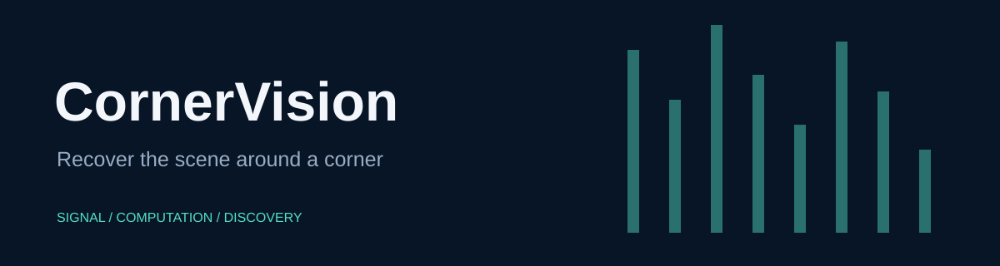

# CornerVision

Ordinary-camera computational periscopy: calibrated forward models, occluder localization, and hidden-scene reconstruction.

Adapted from [Computational-Periscopy/Ordinary-Camera](https://github.com/Computational-Periscopy/Ordinary-Camera), the research code for [*Computational periscopy with an ordinary digital camera*](https://www.nature.com/articles/s41586-018-0868-6) by **Charles Saunders, John Murray-Bruce and Vivek K Goyal** (Nature, 2019). CornerVision adds a MATLAB entry point, analytical geometry checks, setup documentation and project presentation.

## Quick start

Open MATLAB in this repository, then use the branded entry point:

```matlab
point = corner_vision([0 0 0], [1 2 3], [0 1 0], [0 1 0]);
```

The entry point preserves the existing function's arguments, errors, and numerical output. Existing script and function names remain available for compatibility. No sensor starts when you open this repository.

## Inputs and workflows

For complete image reconstructions, start with fig4_column_c.m, fig4_column_d.m, or fig4_column_e.m. These scripts use GPU arrays and require Parallel Computing Toolbox with a supported NVIDIA GPU. The total-variation solvers also call the statistics function `nansum`. The unchanged data-path setup covers macOS and Windows; Linux paths are not configured.

Supplemental image experiments are fig_S1_S2.m, fig_S9.m, fig_S14.m, fig_S15.m and fig_S16.m. They share the GPU requirement. The separate table_S1.m occluder-localization workflow uses CPU arrays; see [verification details](docs/VERIFICATION.md) for its tested scope. Run from the repository root. Bundled Data measurements are retained. The optional stack_combine helper uses the statistics function nanmedian.

## Verification

Run `run('tests/smoke_test.m')` from the repository root. See [verification details](docs/VERIFICATION.md) for the tested scope and unavailable checks. Computational source and bundled scientific assets are retained byte-for-byte; the added facade and documentation provide the new presentation.

## License

MIT covers CornerVision's added entry point, tests, documentation and artwork. It does not relicense the original research code or measurement data; see [NOTICE](NOTICE) for source attribution and scope.
